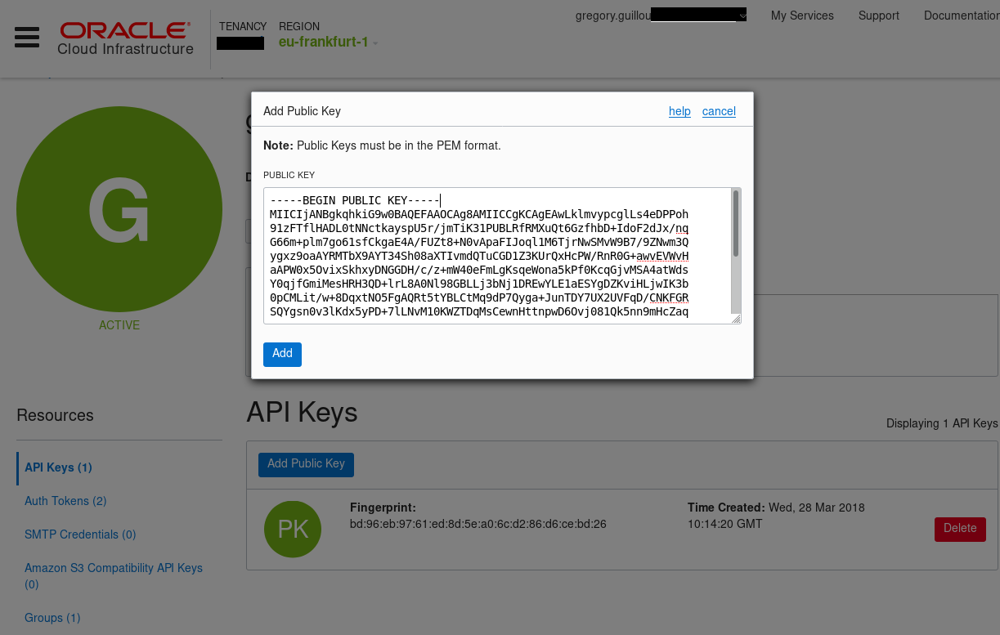

# Installation and configuration

## Install the required components

In order to speed up your work, you might want to rely on a set of tools and
install them on your laptop:

- [Terraform 0.11+](https://www.terraform.io/downloads.html) You can download and uncompress it so that it can be accessed from your `PATH`. It might also be installed from your favorite package manager.
- Terraform [OCI Provider 2.1.12+](https://github.com/oracle/terraform-provider-oci/releases) You can download and uncompress it as part of your plugins, in `~/.terraform.d/plugins` (see 
[here](https://github.com/oracle/terraform-provider-oci) for instructions on how to install)
- The [OCI Command Line Interface](https://github.com/oracle/oci-cli) or OCI CLI. The fastest way to get the latest version on Mac/Linux, assuming you have `python` or `python3` installed with `pip`, is to run `sudo pip install oci-cli`.
- You might also want to install and use more tools, like `jq`, `ssh`, `openssl`, `curl`...

## Configure access to your account

In order to access OCI from the Command Line Interface or `terraform`, you must
have a user registered with OCI. You must also create a secure a RSA key and
register its public counterpart in your user `API Keys` section of your user.

Below is an example of how to create a RSA key with openssl:

```shell
openssl genpkey -algorithm RSA -des3 \
  -out key.pem -pkeyopt rsa_keygen_bits:4096 \
  -pass pass:password

mv key.pem key.pem.with-password

openssl rsa -in key.pem.with-password \
  -out key.pem -passin pass:password

openssl rsa -in key.pem \
  -pubout > key.pub
```

Once done, you should register your API Key with OCI like below:



Last, the easiest way to access OCI from terraform is probably to configure the OCI CLI with the `oci setup config` command

```text
[...]
Enter a location for your config [/home/gregory/.oci/config]: 
Enter a user OCID: ocid1.user.oc1..aaaaaaaaxxx
Enter a tenancy OCID: ocid1.tenancy.oc1..aaaaaaaaxxx
Enter a region (e.g. eu-frankfurt-1, uk-london-1, us-ashburn-1, us-phoenix-1): eu-frankfurt-1 
Do you want to generate a new RSA key pair? (If you decline you will be asked to supply the path to an existing key.) [Y/n]: n
Enter the location of your private key file: ~/.oci/gregory.pem
Fingerprint: bd:96:eb:97:61:ed:8d:5e:a0:6c:d2:86:d6:xx:xx:xx
Config written to /home/gregory/.oci/config
```

Your configuration should be kept in a config file like below:

```shell
% cat /home/gregory/.oci/config
[DEFAULT]
user=ocid1.user.oc1..aaaaaaaaxxx
fingerprint=bd:96:eb:97:61:ed:8d:5e:a0:6c:d2:86:d6:xx:xx:xx
key_file=~/.oci/gregory.pem
tenancy=ocid1.tenancy.oc1..aaaaaaaaxxx
region=eu-frankfurt-1
```

You can test it is working as expected with a command like below:

```shell
 oci iam region list \
   --query='data[].{name:name}' \
   --output table
+----------------+
| name           |
+----------------+
| eu-frankfurt-1 |
| us-ashburn-1   |
| uk-london-1    |
| us-phoenix-1   |
+----------------+
```

## Build a first set of resources

You'll find a first set of resources in the `terraform` directory of the
project. It contains a 2 `.tf` files:

- `provider.tf` defines the provider configuration, including the user,
  keys, compartment and region that must be used. You must set those
  variables before you use the `terraform` command. the `setup.sh`
  script that comes at the project root, set the associated environment
  variable from the `~/.oci/config` file.
- `backbone.tf` is a very basic file that contains a `data` structure to
  extract some configuration from OCI, in that case the availability
  domains and displays it on the output.

In order to use these script, go to the terraform directory, run the
following commands

```shell
cd terraform
source ../setup.sh

# Set providers, state and get the modules if any
terraform init

# Create terraform resources
terraform apply

# Display the state content
terraform state list
```

## Create a compartment to continue

Before you move on to the next step, create a separate compartment for your
tests. This way you will work in a separate enviromnet from other. You can do
it from the CLI.

> Important: You cannot delete a compartment so chose its name with
  care. Below the compartment is named `DevTeam`

```shell
oci iam compartment create \
  --compartment-id="${TF_VAR_tenancy}" \
  --name="DevTeam" \
  --description="A compartiment to be use by developers" \
  --wait-for-state=ACTIVE \
  --max-wait-seconds=300 \
  --wait-interval-seconds 5

oci iam compartment list \
  --compartment-id=${TF_VAR_tenancy} \
  --all \
  --query='data[?name == `DevTeam`].{compartment:"id"}' \
  --output=json \
   |  jq -r '.[].compartment'
```

Create a `.env` at the root of the project from the `.env.template` with
the compartment ID you've just created.

## Move to the next step

The `02-demo` branch of the project contains the follow-up. Before you move
to that branch, make sure you:

- Have an `.env` file with the compartment you will be using for your demo
- Have applied terraform with the `terraform apply`command ans as a result a
  very basic `terraform.tfstate` in the directory.

```shell
git checkout -b 02-demo origin/02-demo
```
