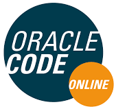

# The OracleCode ChatOps

This section provides a ChatOps named OracleCode that can interact with Slack
and Twitter. In order to deploy it, you must connect to a Oracle Kubernetes
Engine, an Oracle Registry in addition to Slack and Twitter. This Bot will
be used during the presentation... Stay tuned!

